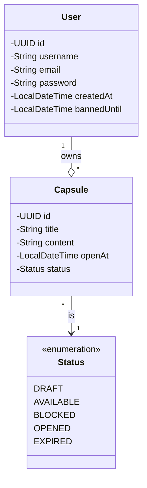

```mermaid
classDiagram
    class User {
        -UUID id
        -String username
        -String email
        -String password
        -LocalDateTime createdAt
        -LocalDateTime bannedUntil
    }

    class Capsule {
        -UUID id
        -String title
        -String content
        -LocalDateTime openAt
        -Status status
    }

    class Status {
        <<enumeration>>
        DRAFT
        AVAILABLE
        BLOCKED
        OPENED
        EXPIRED
    }

    User "1" --o "*" Capsule : owns
    Capsule "*" --> "1" Status : is
```